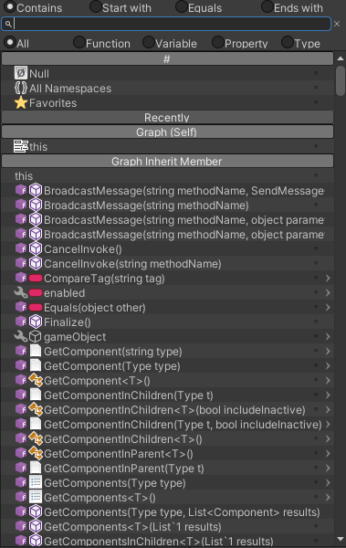

# Editor Interface

## The Graph Editor

Graph Editor can be opened from menu: **‘Tools / uNode / uNode Editor‘**.
When you first start the uNode Graph Editor the interface will look like this:

### Tool Bar

In the Tool Bar you’ll find useful tools and button from debugging, lock the selection, preview c#, compiling to c#, hide/show the sidebar, and switch between inspector and tools panel.

| Tools     | Description                                               |
| --------- | --------------------------------------------------------- |
| Debug     | Enable, Disable, or select specific object for debugging. |
| Preview   | Preview C# Source Code from currently opened graph        |
| Compile   | Compile graphs to native c# scripts                       |
| Select    | Find and select the graph asset in project or hierarchy   |
| Lock      | Lock the selection ( only for "Main" tab )                |
| Refresh   | Refresh the currently edited graph                        |
| Inspector | Show / Hide the graph inspector                           |

### Left Panel / Sidebar

In the left panel its contains information about how many classes, variables, properties, functions and much more. You can even manage it ex: modify the classes, variable, property, function etc on this panel.

### Tab Bar

The Tab Bar contains a button for currently opened graphs, current focused / edited graphs, and a '+' button for open a new graph from recent opened graph or from file.

### Deep Bar

The Deep Bar contains a button for how the deep is in the current graph. The first button is the top level of what root you opened whatever is that functions, constructor, or properties.

You can also click on the the bar for quickly change to other graph canvas ( function, constructor, or properties )

### Canvas

Canvas or a Graph Canvas is the main part of the editor, the canvas is very powerful graph editor which you can manage node to implement a logic for your games.

### Status Bar

The Status bar contains information for how many errors you have, the current zoom level, and other status. You can also find specific nodes from this bar by filling the search bar.

### Minimap

The Minimap is element for showing many nodes like a radar for quick navigation so you can easily navigate or find node in the canvas.

### Graph Hotkey

| **Command**              | **Description**                                       | **Usage**        |
| ------------------------ | ----------------------------------------------------- | ---------------- |
| SHIFT + Left Click       | Inspect Value                                         | All              |
| ALT + Left Click         | Rename variable, property, and function               | Left Panel       |
| CTRL + C                 | Copy selected node                                    | Canvas           |
| CTRL + V                 | Paste selected node                                   | Canvas           |
| CTRL + D                 | Duplicate selected node                               | Canvas           |
| CTRL + Left Click        | Add / remove node to / from selections                | Canvas           |
| Space bar                | Open Command : typing to create a nodes               | Canvas           |
| F                        | Frame graph to whole graph or selected node ( Graph ) | Canvas           |
| Hold CTRL                | Invert Enable / Disable Carry Nodes                   | Canvas           |
| SHIFT + Left Click       | Inspect node, variable, function, and properties.     | Node, Left Panel |
| SHIFT + Left Click       | Select nodes                                          | Canvas           |
| SHIFT + ALT + Left Click | Delete nodes                                          | Canvas           |

## Item Selector

Item Selector is a searchable menu that lists every node, type, variable, function, or selectable menu available to you in uNode.
It is used for:

- Adding Nodes: You can open the item selector by right-clicking anywhere in the Graph Editor and select ‘Add Node‘ or ‘Add Node (Set)‘
- Adding New Variable
- Adding New Property
- And others that’s related to finding Type, Graph, or a specific menu

The Item Selector Interface:

You can filter by the item name that’s match to ‘Contains’, ‘Start with’, ‘Equals’, or ‘Ends with’ the search text.
 Or filter by Item kind like Function, Variable, Property or Type.

### Tips

- Use capital text for quicker search e.g. writing ‘GC‘ if you want to find ‘GetComponent‘. Also it even allowing for partial words, such as ‘GComInC‘ to find ‘GetComponentInChildren‘
- Quickly array search by typing with endings ‘[]’ e.g. writing ‘str[]‘ will show array of string, or writting ‘str[] get‘ will show a Get method for array of string.
- You can also select deep items by Right Clicking on item that have '>' icon at the right end of each item.
- Mark frequently item (variable, function, property, namespaces, etc) as favorites so you can easy find it on 'Favorites' group.