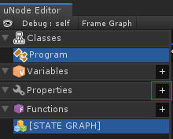
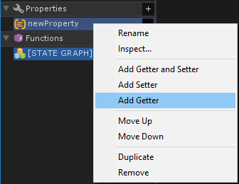
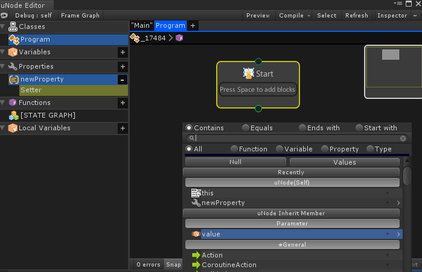
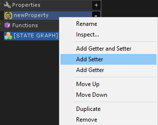

# Properties

A property is a member that provides a flexible mechanism to read, write, or compute the value of a private variable. In uNode get accessor is called `Getter` and set accessor is called `Setter`, if property does’t implement Getter and Setter the property are automatic converted to auto property which mean the property can be get or set and has its own value just like variable.

- Properties enable a class to expose a public way of getting and setting values, while hiding implementation or verification code.
- A get property accessor is used to return the property value, and a set accessor is used to assign a new value.
- The value keyword is used to define the value being assigned by the set accessor.

## Adding Property

You can add property by clicking on the ‘+’ in property inside uNode Editor.

And select your desired type, after that new property are added without getter and setter. 
When a property doesn’t have getter and setter it mean it is a auto property which act just like variable.

## The Getter

The getter is just like a function with return type according to property type so it must return a value of the property type. The getter can be used to return the variable value or to compute it and return it.
To create getter simply right click on the property and select `Add Getter`

## The Setter

The setter is just like a function without needed to return a value ( void ).
It is have one parameter named ‘value‘, whose type is the type of the property.

To create setter simply right click property and select ‘Add Setter‘

