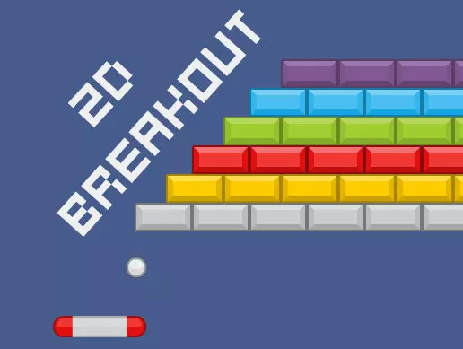

# 2D Breakout

This examples based on [2D Breakout Example Project](https://assetstore.unity.com/packages/templates/packs/2d-breakout-example-project-107757).

This example was made by using CSharpParser to parse the following script:
- Ball_script.cs
- Brick_script.cs
- GameManager_script.cs
- GameOverDetector_script.cs
- Paddle_script.cs

Those script are parsed to C# Graphs and converted again to Runtime Graph ( Class Component and Component Singleton )

[Download](https://drive.google.com/file/d/1aKp8y1OLUju-EB8x7Mr4as_mG7jkOUSg/view?usp=sharing)

> [!NOTE]
> You need to install uNode first and please read the ‘Readme-Installation.txt‘ for installation instructions.