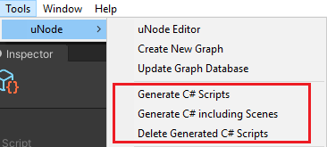
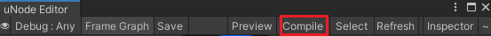
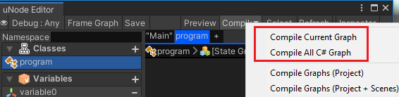

# Compiling Graphs

The compiling graphs is a process to generating c# source code from uNode graphs.
In uNode all of the graphs can be compiled to c# scripts to ensure the graph is executed with the best performance just like the regular c# is executed.

## Compiling Runtime Graphs

All runtime graphs can be compiled from menu `Tools > uNode > Generate C# Script` or `Tools > uNode > Tools > uNode > Generate C# including scene`.

Or alternatively you can directly compiling it from uNode Editor window:

|Menu  |Description  |
|---------|---------|
|Generate C# Script     |Compile All Runtime Graph in the project.         |
|Generate C# Scripts including Scenes     |Compile All Runtime Graph in the project including graphs in all Scenes. ( This will load each Scenes in Build Setting )         |
|Delete Generated C# Scripts     |Remove All Runtime Graph Compiled Script in the projects.         |

> [!TIP]
> You can optionally skip some graph for compiling into c# by turning `off` the `Compile to C#` in individual graph property.

## Compiling C# Graphs

The C# Graphs can only be compiled from uNode Editor window:

You can either compile it indivually or compile all the c# graphs in the project but individual compile is recommended.

## Auto Compile On Build

uNode comes with the auto c# code generation on build, this will make your game get the best performance by running it with native c# code instead of reflection.

The auto compile on build can also be disable from the uNode [Preference](preferences.md).

> [!NOTE]
> Auto compile on build features only compile Runtime Graphs that's existed on the project.
> An embedded graphs that is live on the scene will be skipped. In case you need the embedded graphs to be compiled, use manual compile menu `Tools > uNode > Generate C# including scene` instead.