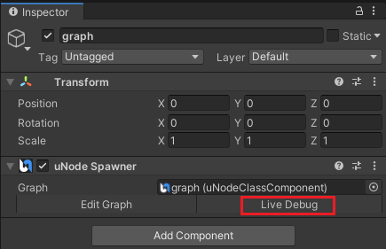
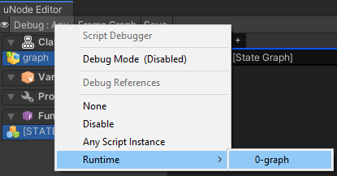
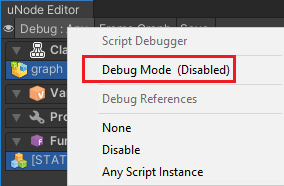
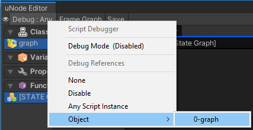

# Debugging

uNode supports debugging in both Runtime Graphs and C# Graphs. With debugging feature you can visually view the running nodes, ports, and it's value real time while in play mode. This provides a way to visualize the running graphs so that you can see what's running and not.

## Debuggin graphs with reflection mode

For debuggin graphs with reflection mode you can dirrectly select the 'Game Object' in heirarchy or by opening graph asset then manually select the graph instance.

For debuggin graph by selecting the Game Object in heirarchy here is the steps:
1. Select the `Game Object` that's have 'uNode Spawner' from the Hierarchy window
2. `Navigate` to inspector
3. Click on the `Live Debug`

For debuggin graph from the graph asset, here is the steps:

1. Open graph you want to debug
2. Click on the `Debug` from the Toolbar
3. Select the graph you want to debug

## Debuggin graphs with c# mode

Firstly before you can debug your compiled graph, you need to enable the `Debug Mode`. 
To enable the `Debug Mode` you can click on the `Debug > Script Debugger > Debug Mode`.

After that you need to re-compile the graph.

To begin debuggin the graph you can select the object instance by clicking on the `Debug > Object > 'MyInstance'`

