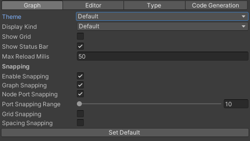
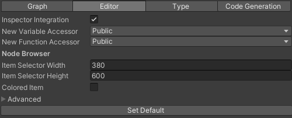
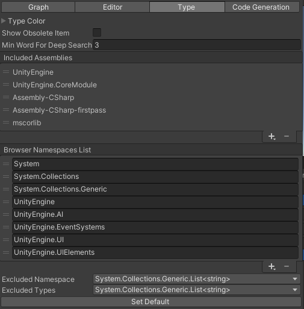
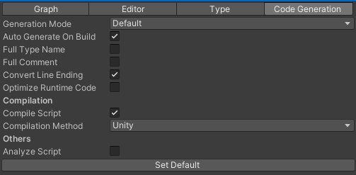

# Preferences

uNode provides a number of preferences that let you customize uNode.

To access the Preferences, go to Edit > Preferences (Windows) or Unity > Preferences (macOS) from the main menu in Unity after open Unity Preference navigate to `uNode` to see and edit uNode preferences. The following preference categories are available:
- Graph
- Editor
- Type
- Code Generation

## Graph category

|Property  |Description  |
|---------|---------|
|Theme     |The list of available graph theme, customization is available except for `Default` theme.|
|Display Kind     |The display kind of a node.         |
|Show Grid     |Enable or disable the canva grid background.|
|Show Status Bar     |Show or hide the status bar.|
|Max Reload Milis     |The maximum progress in milis for loading graph in each frame.|
|Enable Snapping     |Enable or disable the node snapping.|
|Graph Snapping     |Enable or disable the snapping to a graph.|
|Node Port Snapping     |Enable or disable the snapping to a node ports.|
|Port Snapping Range     |The maximum range for port snapping.|
|Grid Snapping     |Enable or disable the snapping to a grid.|
|Spacing Snapping     |Enable or disable the spacing snapping.|

## Editor category

|Property  |Description  |
|---------|---------|
|Inspector Integration|Enable or disable the graph inspector integration to a Unity Inspector window.|
|New Variable Accessor|The new accessor modifier for new added variable|
|New Function Accessor|The new accessor modifier for new added function|
|Item Selector Width|The width of a Item Selector window|
|Item Selector Height     |The height of a Item Selector window|
|Colored Item     |If true, the item in Item Selector will be colorized based on it's kind|

## Type category

|Property  |Description  |
|---------|---------|
|Type Color|Customize the type colors|
|Show Obsolete Item|Display the obsolete item when searcing item|
|Min Word For Deep Search|The miminum word for performing deep searching.|
|Included Assemblies|The included assemblies for searching item|
|Browser Namespaces List|The list of a namespaces that's displayed on Node Browser|
|Excluded Namespace|The list of excluded namespaces for searching|
|Excluded Type|The list of excluded types for searching|

## Code Generation category

|Property  |Description  |
|---------|---------|
|Generation Mode|The generation mode for a graphs.<ul><li>Default is using individual graph setting and force to be pure when the graph use default</li><li>Performance: is forcing to generate pure c# and get better performance but it may give errors when other graph is not compiled into script.</li><li>Compatibility: is forcing to generate c# script that's compatible with all graph even when other graph is not compiled into script.</li></ul>|
|Auto Generate On Build|If true, will auto compile all graphs in project on build|
|Full Type Name|If true, the type will be written in full type name including it's namespace|
|Full Comment|If true, will include the comment for nodes|
|Convert Line Ending|If true, will convert the line ending of the generated c# source|
|Optimize Runtime Code|If true, will make an optimization for the Runtime Graphs so it can be accessed with more fasters|
|Compile Script|Enable or disable compile before save|
|Compilation Method|The compilation method:<ul><li>Unity The generated scripts will be saved in 'Assets/uNode.Generated' folder and will be compiled by Unity, the assembly result is natively loaded.</li><li>Roslyn The generated scripts will be saved in temporary folder and will be compiled by Roslyn Compiler, the assembly result is automatic loaded on Play. Using this method will result in fast compilation and doesn't need a Domain Reload each time you're compiling the graphs also this method is seamlessly integration with the Fast Enter Play Mode so you can prototype and test idea more faster. Note: Auto Generate on Buld will always using Unity method.</li></ul>|
|Analize Script|Analize the generated script|