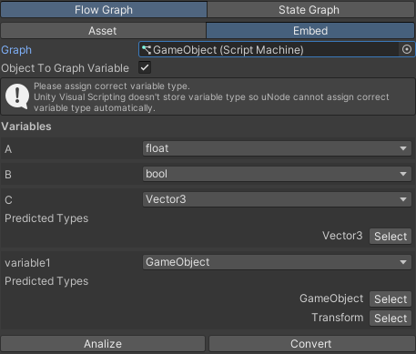

# Unity Visual Scripting converter add-ons

UVS converter add-ons are used to convert Unity Visual Scripting graph to uNode graph.

Before using UVS Converter you need to import this add-ons, navigate to `Tools > uNode > Welcome > Add-ons` and click on the `UVS Converter` to import the add-ons.

To open C# Parser, navigate to `Tools > uNode > UVS Converter`

> [!IMPORTANT]
> This add-ons is tested with `Unity Visual Scripting v1.7.6`, using this add-ons for older version of Unity Visual Scripting may not work.

> [!NOTE]
> This features is still in earlier version there might be a bug that stop it working.
>  Also uNode may not be able to convert some unit ( especially custom unit ) in your UVS graph, if it happen you need to convert `Dummy` (the not supported / invalid converted) node to the correct node manually.

## Converting Flow Graph into uNode graph

There's two ways for converting Flow Graph into unode graphs.

### Script Graph Asset

1. Open UVS Converter
2. Navigate to `Flow Graph > Asset`
3. Assign the `Graph` property
4. Change the `Parse To` property based on your graph type.
   - If your graph type is regular flow graph then use `Class Component`
   - If your graph type is macro graph use `Macro`
5. Enable or disable the `Object To Graph Variable`, if this option enable then the Variable that's embedded to `Game Object` will then be converted to uNode variable.
6. Since the UVS variable is not store it's type data, uNode will need manual extra steps for correctly convert the UVS variables. 
   -Firstly you need to click on `Analize`
   -After that you need to manually find and fix the variable that have wrong type.
	> [!NOTE]
	> We do have a predicted type based on `Value` of that variable and based on connection to the variable in your graph.  The first assigned type is our predicted type by using the analizer, the type may `incorrect` and you must change it to correct value so that uNode can correctly convert your graph.  You can change it by clicking on the variable type or selecting the available predicted types.
7. Click on `Convert` to start converting it, the result graph will be saved in the project with same folder and file name with the converted graph.

### Script Machine

1. Open UVS Converter
2. Navigate to `Flow Graph > Embed`
3. Assign the `Graph` property
4. Enable or disable the `Object To Graph Variable`, if this option enable then the Variable that's embedded to `Game Object` will then be converted to uNode variable.
5. Since the UVS variable is not store it's type data, uNode will need manual extra steps for correctly convert the UVS variables. 
   -Firstly you need to click on `Analize`
   -After that you need to manually find and fix the variable that have wrong type.
	> [!NOTE]
	> We do have a predicted type based on `Value` of that variable and based on connection to the variable in your graph.  The first assigned type is our predicted type by using the analizer, the type may `incorrect` and you must change it to correct value so that uNode can correctly convert your graph.  You can change it by clicking on the variable type or selecting the available predicted types.
1. Click on `Convert` to start converting it, the result graph will be placed in `Heirarchy` window

## Converting State Graph into uNode graph

This features is swill Work In Progress, there's no ETA currenntly.