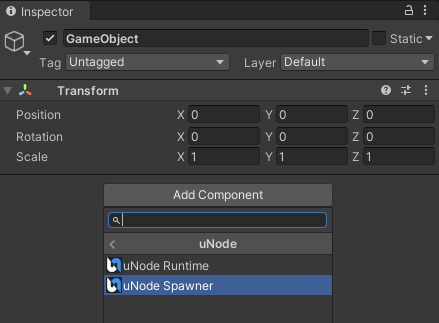
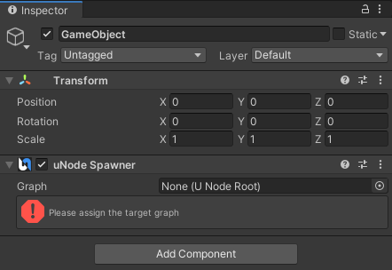

# Attach a graph file to a Game Object

To use a `Class Component` graph in your project, you need to attach it to a uNode Spawner in a Game Object.

A `Class Component` is a component. Components attach to GameObjects, and help define their behavior. For more information on components and GameObjects, see [the Unity User Manual on using components](https://docs.unity3d.com/2021.1/Documentation/Manual/UsingComponents.html), or [the section on GameObjects](https://docs.unity3d.com/2021.1/Documentation/Manual/GameObjects.html).

## Attach graph with drag & drop

To attach a `Class Component` graph to a Game Object you can drag the graph file from Project window and drop it to a 'Game Object' in the Hierarchy window.

## Attach graph with uNode Spawner

1. In the Hierarchy window, select a GameObject where you'd like to add a Class Component. If the Hierarchy window isn't visible, go to Window > General > Hierarchy or press CTRL + 4 (macOS: Cmd + 4).
2. (Optional) If the Inspector window for your selected GameObject doesn't appear, press CTRL + 3 (macOS: Cmd + 3), or go to Window > General > Inspector. 
3. In the GameObject's Inspector window, select Add Component. The Components menu opens.
4. To add a `Class Component`, in the Components menu, go to uNode and select `uNode Spawner`. Or, use the search bar to find the 'uNode Spawner' component. 
   
5. The new uNode Spawner component appears in the Inspector window for your GameObject:
   
6. Assign the target graph with the Class Component graph. You can assign it by browse the available graphs by clicking on the  or by drag & drop the graph file to the 'Graph' field.