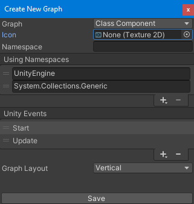

# Creating a new Class Component graph

To create a new Class Component graph, you can use the Graph Creator windows found on menu: `Tools > uNode > Create New Graph` or from a `Project` window with `Right click > Create > uNode > Class Component`

- In Graph Creator window, make sure that the `Graph` is set to `Class Component`.
- Assign the `Icon` to set the graph Icon, or leave it none to use default icon instead.
- Assign the `Namespace` to set the graph namespace, when you leave it blank the graph will be placed on `Generated Type` namespace when you're searching the graph and when you're compiling the graph, the namespace will be `MaxyGames.Generated`
- You can add a new `Using Namespace` to make all type in those namespace available when searning a nodes, types, etc.
- You can add a new `Unity Events` to the graph so the new graph get a new Function.
- You can change the `Graph Layout` to `Vertical` or `Horizontal`.
- After all field has been correctly set, click on the `Save` to save the graph in the project.

> [!TIP]
> To keep your project organized, place your new graphs in a `Graphs` folder inside your project's Assets folder.