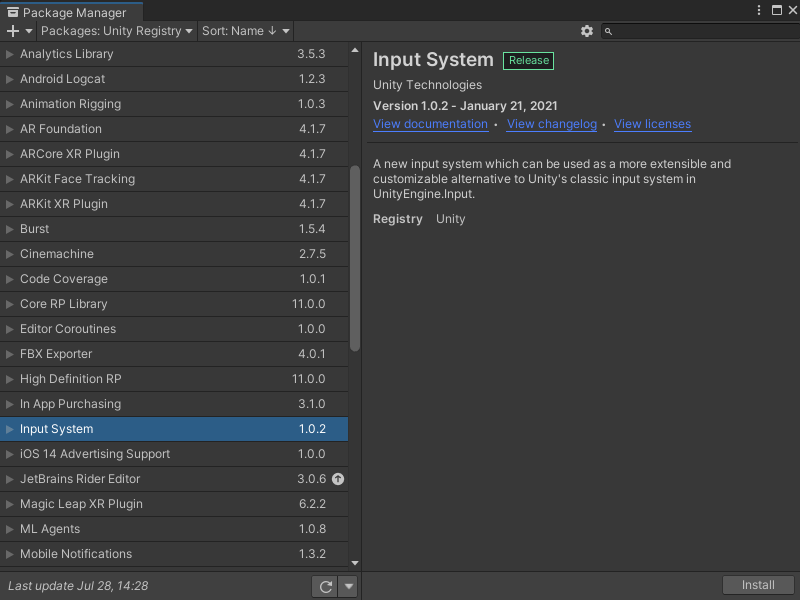
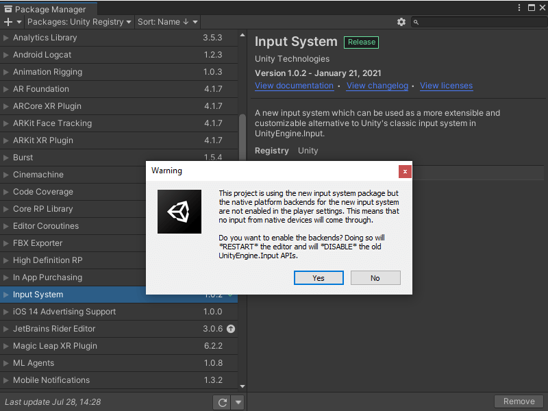
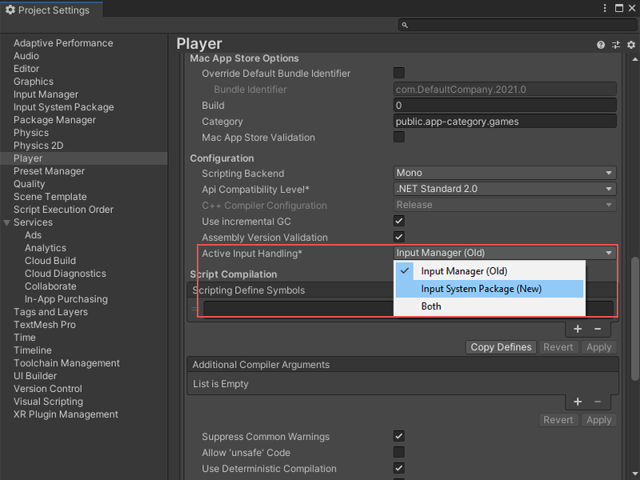
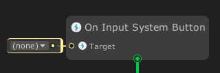
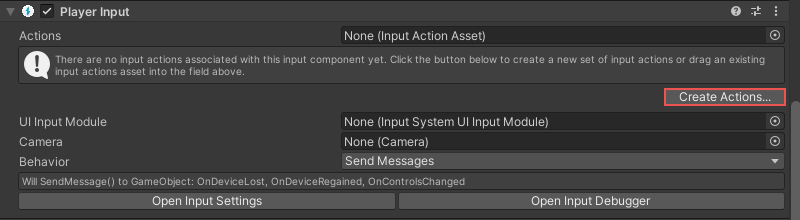
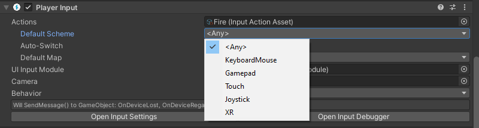
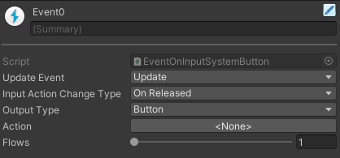
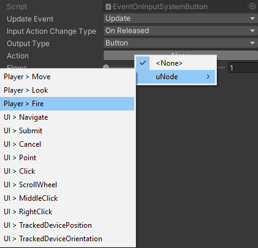
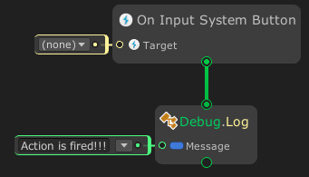

# Capturing player inputs using the new Input System

## Installing and setting up the input system package

To use the input system you must first install the new input system package.

## To install the new input system package

1. Open the Package Manager window **Window > Package Manager**.
2. Select **Unity Registry**. The Package Manager window appears.
3. In the package list, select **Input System**. The Input System tab appears.
   
4. Select the **Install** button.
  A Warning popup appears.
	> [!NOTE]
	> If you plan to use only the new input system select **Yes** in the warning popup.

The new player input system is installed.
The next step is to set up your project to use the new input system.

## To setup your project to use the new input system

> [!NOTE]
> Only complete the following task once you have the new input system installed.

1. Open the Project Settings window by selecting Edit > Project Settings.
2. Click on the Player item in the list and go to **Active Input Handling**. Set the input system to **Input System Package (New)** or **Both**. 
   
	 The Unity Editor restarts to change the input system in use. 
3. A new input system nodes is automatically added and available to use.

Your project is set up with the new player input system.

## Getting started using the new input system nodes

Once you have the new input system package installed and your project is set up you can add new input system event nodes:
- On Input System Event

The first step is to add a Player Input component, after which you can add player nodes that use the new input system.
<!-- The Input System Event node can be added by right clicking on the `Canvas in [State Graph]` and choose `Add Event > Input System > On Input System Event`

 -->

## To add a Player Input component

1. In the **Hierarchy**, select a GameObject that has the input.
2. Select **Add Component**.
3. Select **Player Input**.
   If you do not have any input Actions files, select the **Create Actions** button and save a new input file. 
	 
4. Select the **Actions** selector. 
   The Select InputActionAsset window appears.
5. Select either the input file you created or an existing file in your project.
6. You can change the default input scheme from the Default Scheme drop-down.
   

You can now interact with the input scheme and enter player input event nodes.

## To enter a player input event node

1. Open or create a new **Class Component** graph
2. Right-click on the `Graph Canvas` to open the context menu
   > [!NOTE]
	 > Make sure you are in the `State Graph` canvas because the Event nodes is available only on State Graph.
3. Select `Add Event > Input System > On Input System Event`
4. After adding the node, select the node to change how it will act
5. Navigate to `Inspector`  
 
6. Click on the **Action** property to assign the Input Action
 
   > [!NOTE]
   > uNode will find all Input Action assets in your project and show it in the menu.  If the Input Actions list does not appear, you did not have any Input Action Assets so make sure the previous step are complete successfully.
7. Attach the graph to the Game Object that have the **Player Input** component.
   
As an example of successfully installing and setting up the system and using the Input system event nodes, a debug message appears when you click the mouse button:

> [!NOTE]
> You did not required to fill the `Target` ports, if the port is `(none)` it mean `this / self` value. But you can assign it when you want to listen to **PlayerInput** from other game objects.