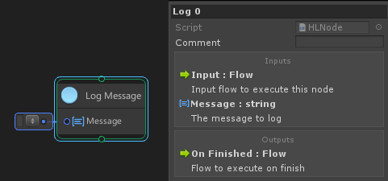
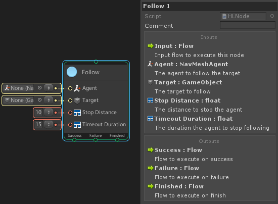
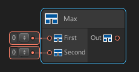
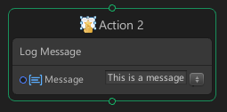

# Creating Custom Node

There are three possible ways you are able to create nodes in uNode:
1. Automatically through reflection.
2. Coding using High Level API.
   A simples and the most easy way to creating custom node by using HL API you can use the type you are already know and don’t have to worry about the code generation, uNode will handle it automatically.
3. Coding using Low Level API ( Currently is undocumented ).
   By using LL API you can full control how the node behave: controlling each port, node styling, and how it behave at runtime but you will need to creating both logic for running in reflection mode and native c# and make sure that’s will behave same at using reflection or native c# mode so you will need to be very carefull when using LL API.

## Creating Nodes using High Level API

Creating Nodes using HL API is the most easy and direct way of creating custom nodes for uNode. To do so, you need to derive from one of the available types.

### IFlowNode

Implement `IFlowNode` to create flow node that has one input and output flow port. They usually perform logical decisions or operations/actions. They execute in a single frame, when triggered.  To implement it you must implement `void Execute(object graph)` method.

Examples:

Log a message to the console:

```cs
using UnityEngine;
namespace MaxyGames.uNode.Nodes {
  [NodeMenu("Flow", "Log Message")] //Add the node to the menu
  public class LogMessage : IFlowNode {
    [Tooltip("The message to log")]
    public string message;
    public void Execute(object graph) {
      Debug.Log(message);
    }
  }
}
```

Result Node:



### IStateNode

Implement `IStateNode` to create flow node that has one input and 3 output ( success, failure, finished ). The state node are just like an IF Node they are executed and compare the return state true or false. They execute in a single frame, when triggered. To implement it you must implement `bool Execute(object graph)` method.

Examples:

```cs
using UnityEngine;
namespace MaxyGames.uNode.Nodes {
  [NodeMenu("Flow", "Is All True")] //Add the node to the menu
  public class IsTrue : IStateNode {
    public bool first;
    public bool second;
    public bool Execute(object graph) {
      return first && second;
    }
  }
}
```

### ICoroutineNode

Implement `ICoroutineNode` to create coroutine node that has one input and output. They can execute in a multiple frame, when triggered.  To implement it you must implement `IEnumerable Execute(object graph)` method.


Examples:

```cs
using UnityEngine;
namespace MaxyGames.uNode.Nodes {
  [NodeMenu("Coroutine", "Wait for second", IsCoroutine = true)]
  public class WaitForSecond : ICoroutineNode {
    public float waitTime;
    public IEnumerable Execute(object graph) {
      yield return new WaitForSeconds(waitTime);
    }
  }
}
```

And:

```cs
using UnityEngine;

namespace MaxyGames.uNode.Nodes {
  [NodeMenu("Flow", "Animate Float", IsCoroutine = true)]
  public class AnimateFloat : ICoroutineNode {
    public AnimationCurve curve;
    public float time;
    public float speed;

    float currentTime;
    float endTime;

    public IEnumerable Execute(object graph) {
      currentTime = 0;
      endTime = curve.keys[curve.length - 1].time;
      while(currentTime < endTime) {
        currentTime += Time.deltaTime * speed;
        time = curve.Evaluate(currentTime);
        yield return null;
      }
    }
  }
}
```

### IStateCoroutineNode

Implement `IStateCoroutineNode` to create state node that can be run in multiple frame. The node will have one input and 3 output (success, failure, finished ). To implement it you must implement `IEnumerable Execute(object graph)` method.

Yield Commands:
- ```cs
	yield return break; 
	```
  will finish the coroutine with the success state and execute On Success flow.
- ```cs
	yield return true; and => yield return false;
	```
  will finish the coroutine with success state and execute On Success flow.

- ```cs
	yield return false; and => yield return “Failure”; 
	```
  will finish the coroutine with failure state and execute On Failure flow. <br> When the Execute function is finished without above command the node will finish with success state.

Examples:

Following object:
```cs
using UnityEngine;
using UnityEngine.AI;

namespace MaxyGames.uNode.Nodes {
  [NodeMenu("State", "Follow", IsCoroutine = true)] //Add the node to menu, and ensure the node is not available to non coroutine graph
  public class Follow : IStateCoroutineNode {
    [Tooltip("The agent to follow the target")]
    public NavMeshAgent agent;
    [Tooltip("The target to follow")]
    public GameObject target;
    [Tooltip("The distance to stop the agent")]
    public float stopDistance = 10;
    [Tooltip("The duration the agent to stop following ")]
    public float timeoutDuration = 15;

    public IEnumerable Execute(object graph) {
      //Cache the current time
      float time = Time.time;
      //Move the agent
      agent.SetDestination(target.transform.position);
      while(true) {
        if(Vector3.Distance(agent.transform.position, target.transform.position) < stopDistance) {
          //Stop the agent if its in range
          agent.isStopped = true;
          //Return a success state, and this command should stop the coroutine.
          yield return true;
        } else if(Time.time - time > timeoutDuration) {
          //Stop the agent
          agent.isStopped = true;
          //Return a failure state, and this command should stop the coroutine.
          yield return false;
        }
        //Wait for the next frame
        yield return null;
      }
    }
  }
}
```

Result Node:



### DataNode<T>

Implement `DataNode<T>` to create data node with one output value and the T is the output type. They are executed only when an output value is read by another node. To implement it you must override `T GetValue(object graph)`.

Examples:
```cs
using UnityEngine;
namespace MaxyGames.uNode.Nodes {
  [NodeMenu("Data", "Max")]
  public class MaxNode : DataNode<float> {
    public float first;
    public float second;
    public override float GetValue(object graph) {
      return Mathf.Max(first, second);
    }
  }
}
```

Result Node:



## Creating Blocks using High Level API

The HL API also support creating a block ( action & condition ). To do so you just need to add BlockMenu attribute in the node.

Examples:
```cs
using UnityEngine;
namespace MaxyGames.uNode.Nodes {
  [NodeMenu("Flow", "Log Message")] //Add the node to the menu
  [MaxyGames.Events.BlockMenu("Log", "Log Message")] //Add the node to the block menu
  public class LogMessage : IFlowNode {
    [Tooltip("The message to log")]
    public string message;
    public void Execute(object graph) {
      Debug.Log(message);
    }
  }
}
```

Block Result:



Available base types for creating blocks:
- IFlowNode for action block
- IStateNode for action block
  The result state can also be store to a bool variable
- ICoroutineNode for coroutine block
  Must set the isCoroutine to true in BlockMenu attribute
- IStateCoroutineNode for coroutine block
  Must set the isCoroutine to true in BlockMenu attribute
- IDataNode<bool> for condition block