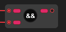

# And

The `And` node compare the input ports, If all of the input ports is `true` then the output port will return `true` otherwise when one of the input ports is `false` the output will be `false`.