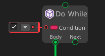
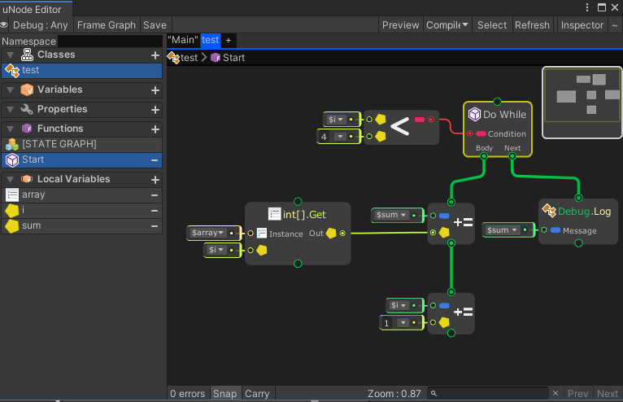

# Do While



The `DoWhile` node executes a Body node repeatedly until a `Condition` evaluates to false.

## Examples

Graph:


Generated script:
```cs
#pragma warning disable
using UnityEngine;
using System.Collections;
using System.Collections.Generic;

public class test : MonoBehaviour {

	public void Start() {
		int[] array = new int[] { 6, 7, 8, 10 };
		int i = 0;
		int sum = 0;
		do {
			sum += array[i];
			i += 1;
		} while((i < 4));
		Debug.Log(sum);
	}
}
```

Output:
```
31
```