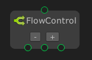
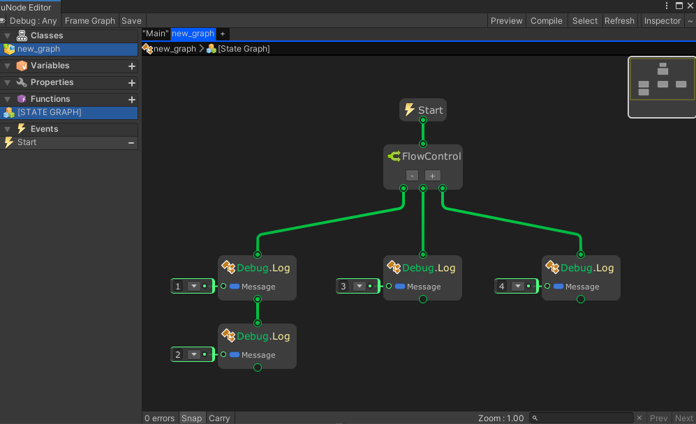

# Flow Control



The `Flow Control` node executes output flows sequentially from left to right.


## Examples

Graph:


Generated script:
```cs
#pragma warning disable
using UnityEngine;
using System.Collections.Generic;

namespace MaxyGames.Generated {
	public class new_graph : MaxyGames.RuntimeBehaviour {

		void Start() {
			Debug.Log("1");
			Debug.Log("2");
			Debug.Log("3");
			Debug.Log("4");
		}
	}
}
```

Output:
```
1
2
3
4
```