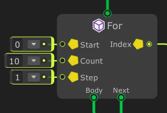
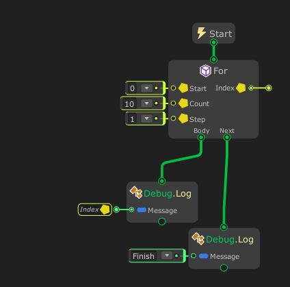

# For



By using a `For` node , you can run node repeatedly until a specified condition evaluates to false.


## Examples

Graph:




Generated script:
```cs
#pragma warning disable
using UnityEngine;
using System.Collections.Generic;

namespace MaxyGames.Generated {
	public class graph : MaxyGames.RuntimeBehaviour {
		public float variable0 = 0F;

		void Start() {
			for(int index = 0; index < 10; index += 1) {
				Debug.Log(index);
			}
			Debug.Log("Finish");
		}
	}
}

```

Output:
```
0
1
2
3
4
5
6
7
8
9
Finish
```