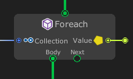
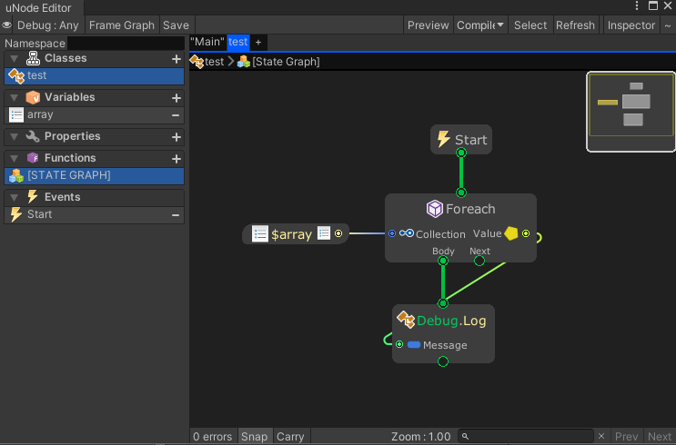

# Foreach



The Foreach node repeats Body port for each element in an array or an object collection.

## Examples

Graph:



Generated script:
```cs
#pragma warning disable
using UnityEngine;
using System.Collections.Generic;

public class test : MonoBehaviour {
	public int[] array = new int[] { 1, 2, 4, 8, 16 };

	void Start() {
		foreach(var loopObject in array) {
			Debug.Log(loopObject);
		}
	}
}
```

Output:
```
1
2
4
8
16
```