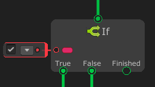
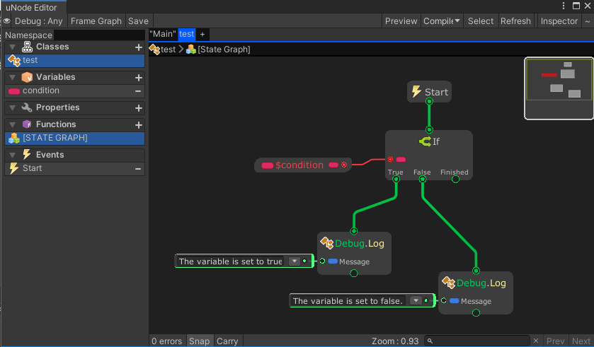

# If



The `If` node Identifies which statement to run based on the value of a Boolean expression.

The `True` port will be executed if the input Condition is `true`, otherwise the `False` port will be executed.

The `Finished` port will be executed once after the `True` or `False` port has been executed.

## Examples

Graph:


Generated script:
```cs
using UnityEngine;
using System.Collections;
using System.Collections.Generic;
public class test : MonoBehaviour {
	public bool condition = true;
	public void Update() {
		if(condition) {
			Debug.Log("The variable is set to true.");
		} else {
			Debug.Log("The variable is set to false.");
		}
	}
}
```

Output:
```
The variable is set to true.
```