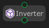

# Inverter

The `Inverter` node will invert the return `state` of the target `flow` after it has finished. If the target flow returns success, the inverter will return failure. If the target flow returns failure, the inverter will return success.