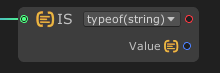

# Is

The `is` node checks if the input data port is compatible with a given type. For information about the type-testing is operator, see: https://docs.microsoft.com/en-us/dotnet/csharp/language-reference/operators/type-testing-and-cast#is-operator