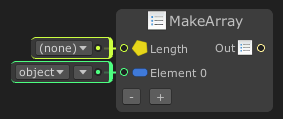

# Make Array

The `Make Array` node will output an array data. Use this node to create a new array of specific type, you can leave the `Length` port to '(none)' for auto detect length based on the `Element` input ports. 

For information about array see: https://docs.microsoft.com/en-us/dotnet/csharp/programming-guide/arrays/