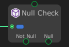

# Null Check

The `Null Check` node compare the input data port if it's null or not.

|Port  |Description  |
|---------|---------|
|Not Null     |Executes when the value of the input is not null.         |
|Null     |Executes when the value of the input is null.         |
