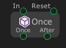

# Once

The `Once` node help for executing flow only once.

When `In` port get called in the first time, the `Once` port will be executed. After that when the `In` get called in more than one time, the `After` port will be executed.