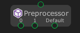

# Preprocessor

The `Preprocessor` node give instruction to the compiler to preprocess the information before actual compilation starts.

> [!CAUTION]
> This node doesn't work when running with reflection mode.