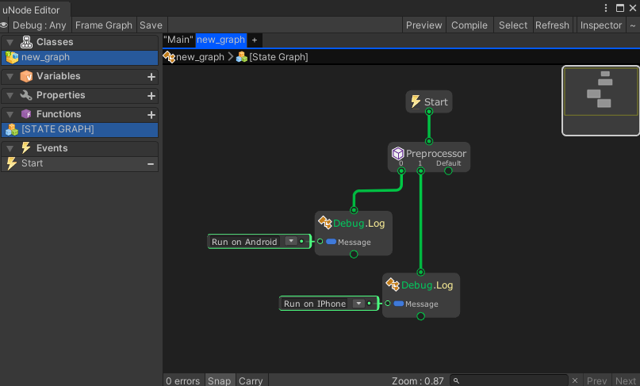

# Preprocessor


The `Preprocessor` node give instruction to the compiler to preprocess the information before actual compilation starts. This node can be used to run specific logic based on platform, see https://docs.unity3d.com/Manual/PlatformDependentCompilation.html

> [!CAUTION]
> This node doesn't work when running with reflection mode.

## Examples

Graph:


Generated script:
```cs
#pragma warning disable
using UnityEngine;
using System.Collections.Generic;

namespace MaxyGames.Generated {
	public class new_graph : MaxyGames.RuntimeBehaviour {

		void Start() {
			#if UNITY_ANDROID
			Debug.Log("Run on Android");
			#elif UNITY_IPHONE
			Debug.Log("Run on IPhone");
			#endif
		}
	}
}
```

Output on running with `Android` platform:
```
Run on Android
```

Output on running with `IPhone` platform:
```
Run on IPhone
```

> [!NOTE]
> If the graph is run within in the **Unity Editor** it will have no output because Unity Editor is not a `Android` or `IPhone` platform, use `UNITY_EDITOR` if you want to run it within the Editor.