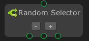
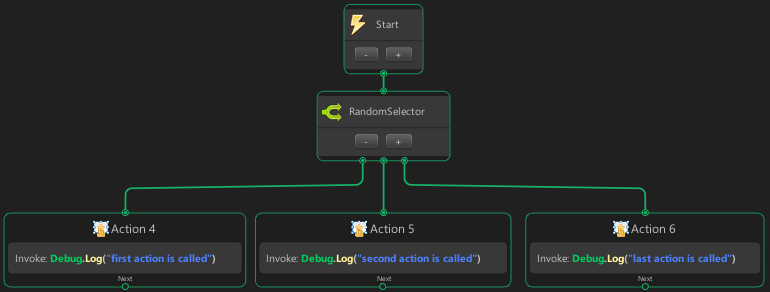

# Random Selector



The `Random Selector` node is Similar to the selector node except the `Random Selector` node will execute flows in random orders, the random selector will return `success` as soon one of its flow returns `success`. 

> [!NOTE]
> - This node can only be created on `State Graph`.
> - This node is using `Coroutine`.

## Examples

In this example, the `Random Selector` node is called at start. It then call flow in random order because all the flow will return success the node will only call one of 3 action in random order.

Program:
- Action 4 : log an message “first action is called”
- Action 5 : log an message “second action is called”
- Action 6 : log an message “last action is called”

Graph:



Output:
```
second action is called
```

> [!NOTE]
> Because of `Random Selector` node execute the flows in random order, the output may be different every node executed.