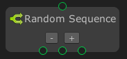

# Random Sequence

The `Random Sequencer` node is Similar to the sequence node except the `Random Sequencer` node will execute flows in random orders, the random sequence will return `success` as soon as every target node returns `success`. 

> [!NOTE]
> - This node can only be created on `State Graph`.
> - This node is using `Coroutine`.