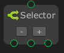
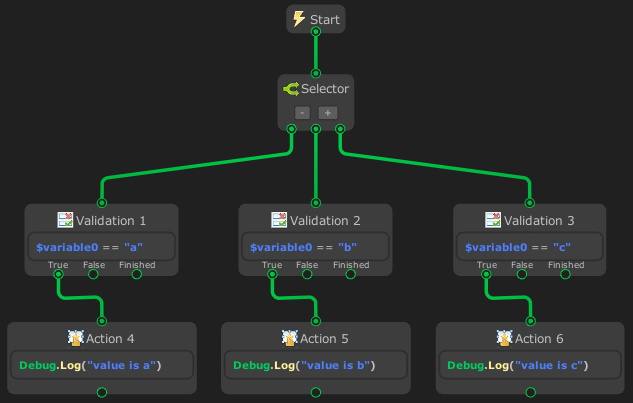

# Selector



The `Selector` node is similar to an `or` operation. It will return `success` as soon as one of its `flow` return `success`. If a flow returns `failure` then it will sequentially run the next flow. If no flow returns `success` then it will return `failure`.

> [!NOTE]
> - This node can only be created on `State Graph`.
> - This node is using `Coroutine`.

## Examples

In this example, the `Selector` node is called at start. It then call flow from up to bottom.

Program:
- variable : `value` = “b”
- Validation 1 : compare variable `value` if value is “a”
- Validation 2 : compare variable `value` if value is “b”
- Validation 3 : compare variable `value` if value is “c”
- Action 4 : log an message “value is a”
- Action 5 : log an message “value is b”
- Action 6 : log an message “value is c”

The Selector will never reach ‘Validation 3’ because the ‘Validation 2’ state is success and Selector will stop.

In this examples i used validation node because it is more readable and more organized for high level logic.

Graph:



Output:
```
value is b
```