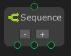
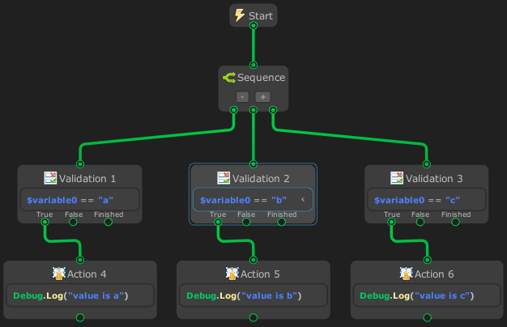

# Sequence



The `Sequence` node is similar to an `and` operation. It will return `failure` as soon as one of its ‘flow’ return `failure`. If a ‘flow’ returns `success` then it will sequentially run the next ‘flow’. If all ‘flow’ return `success` then it will return `success`.

> [!NOTE]
> - This node can only be created on `State Graph`.
> - This node is using `Coroutine`.

## Examples

In this example, the `Sequence` node is called at start. It then call flow from up to bottom

Program:
- variable : `value` = “a”
- Validation 1 : compare variable `value` if value is “a”
- Validation 2 : compare variable `value` if value is “b”
- Validation 3 : compare variable `value` if value is “c”
- Action 4 : log an message “value is a”
- Action 5 : log an message “value is b”
- Action 6 : log an message “value is c”

The Sequence will never reach ‘Validation 3’ because the ‘Validation 2’ state is failure and Sequence will stop of execution and its state will failure.

In this examples i used validation node because it is more readable and more organized for high level logic.

Graph:



Output:
```
value is a
```