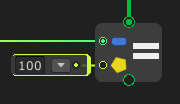
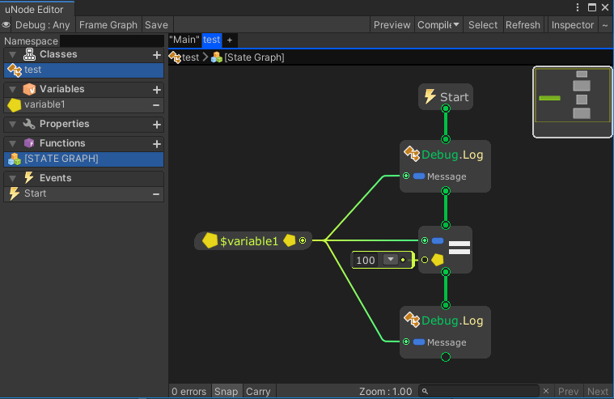

# SetValue



The SetValue node is a node to Set value of a variable, and property.

## Examples

Graph:



Generated script:
```cs
#pragma warning disable
using UnityEngine;
using System.Collections.Generic;

public class test : MonoBehaviour {
	public int variable1 = 0;

	void Start() {
		Debug.Log(variable1);
		variable1 = 100;
		Debug.Log(variable1);
	}
}
```

Output:
```
0
100
```