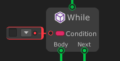
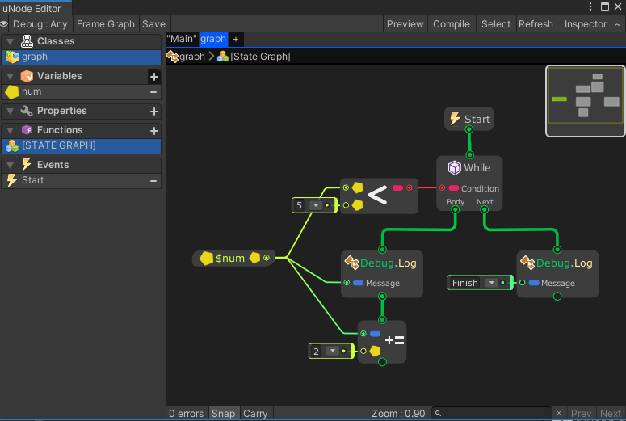

# While



The `WhileLoop` node executes a body until a `Condition` evaluates to false.

## Examples

Graph:


Generated script:
```cs
#pragma warning disable
using UnityEngine;
using System.Collections.Generic;

namespace MaxyGames.Generated {
	public class graph : MaxyGames.RuntimeBehaviour {
		public int num = 0;

		void Start() {
			while((num < 5)) {
				Debug.Log(num);
				num += 2;
			}
			Debug.Log("Finish");
		}
	}
}

```

Output:
```
0
2
4
Finish
```